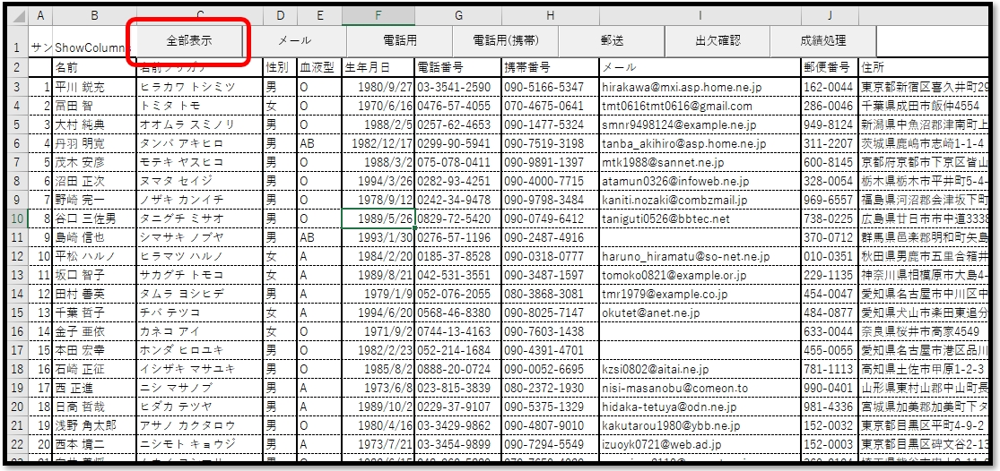
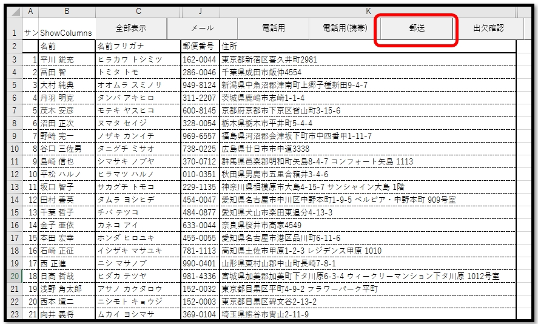
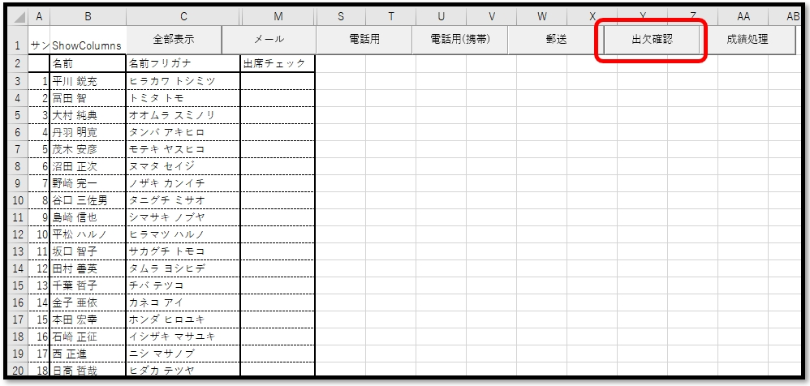
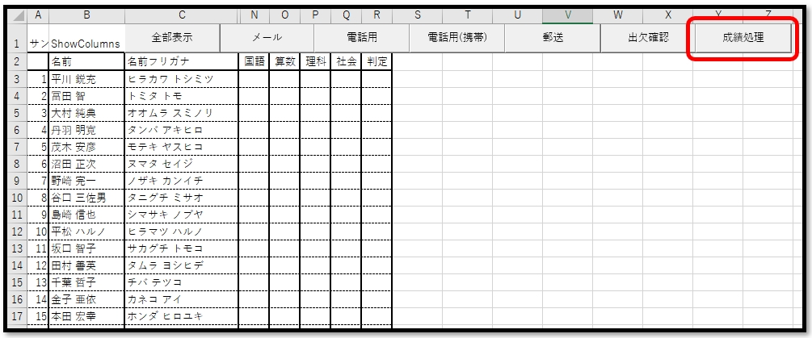
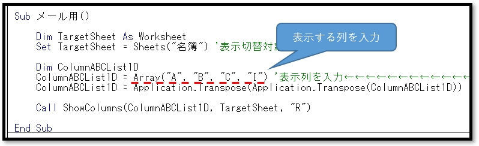

# VBA-ShowOrHideColumns
- License: The MIT license

- Copyright (c) 2021 YujiFukami

- 開発テスト環境 Excel: Microsoft® Excel® 2019 32bit 

- 開発テスト環境 OS: Windows 10 Pro

実行環境など報告していただくと感謝感激雨霰。

# 説明
シートの列の表示、非表示の切り替えを自動化する。

## 活用例
列方向に項目がいっぱいある名簿などで、必要な情報だけを表示したいパターン別でマクロを作成しておけば、切替がすぐできるようになる。

# 使い方
実行サンプル「Sample_ShowColumns.xlsm」のボタンは以下のような動作をする。
。

名簿を全部表示

名簿で郵送先を表示

出欠確認用の名簿

成績処理用の名簿

各名簿の切り替えボタンにおいてのプロシージャでは、表示する列を配列で指定するだけ。

## 設定
実行サンプル「Sample_ShowColumns.xlsm」の中の設定は以下の通り。

### 設定1（使用モジュール）

-  ModTest.bas
-  ModShowColumns.bas

### 設定2（参照ライブラリ）
なし

